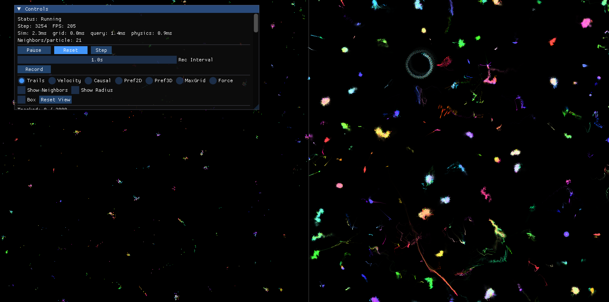

# Social Dynamics — Particle Simulation

Preference-directed particle simulation exploring emergent complex dynamics from simple interaction rules. Particles have preference vectors that determine attraction/repulsion patterns — the interplay between movement, neighbor topology, and preference evolution gives rise to rich self-organizing behavior.



## Quick Start

Must run from **Terminal.app** on macOS for hardware GPU acceleration.

```bash
cd gpu
python3 -m sim_2d_exp
```

### Dependencies

```bash
pip install numpy numba scipy glfw moderngl imgui-bundle PyOpenGL torch
```

## Controls

| Key | Action |
|-----|--------|
| Space | Pause / Resume |
| R | Reset simulation |
| Q / Esc | Quit |
| Scroll | Zoom (left panel) |
| Drag | Pan (left panel) |
| Up/Down | Adjust step size |
| +/- | Adjust social learning rate |
| Cmd+Drag | Select particles for causal tracking |

## Right Panel Views

- **Trails** — temporal trail accumulation of particle positions
- **Velocity** — HSV velocity field (hue=direction, brightness=speed)
- **Causal** — causal tracking visualization (Cmd+drag to select seeds)
- **Pref2D** — preference space scatter plot (dim0 vs dim1)
- **Pref3D** — isometric projection of 3D preference space (120° axes)
- **MaxGrid** — per-dimension max preference grid visualization
- **Force** — force landscape (with variance toggle):
  - Max Pref (RGB) — strongest signal per dimension
  - Optimal Pref (RGB) — which preference vector maximizes force
  - Direction (HSV) — direction of maximum movement
- **Memory** — spatial memory field visualization (RGB per dimension)

## Physics Engines

| Engine | Method | Scaling | Best for |
|--------|--------|---------|----------|
| Numba | Pairwise KNN (CPU JIT) | O(N·K) | Small N, exact physics |
| NumPy | Vectorized CPU | O(N·K) | Reference/debugging |
| PyTorch | Pairwise (MPS/CUDA) | O(N·K) | GPU acceleration |
| Grid Field | Smooth field (Gaussian) | O(N + G²) | Large N, smooth dynamics |
| Grid Max CPU | Max-pool + position tracking | O(N + G²·P) | Large N, discrete dynamics |
| Grid Max GPU | Fused max_pool2d (MPS/CUDA) | O(N + G²) | Large N + GPU |

## Key Features

- **Signal/Response split** — separate broadcast identity from reaction weights
- **Social learning** — positive (conformity) or negative (differentiation)
- **Quiet-dim differentiation** — differentiate along dynamically inactive dimensions
- **Spatial memory field** — persistent grid that modulates preferences based on interaction history ([writeup](spatial_memory.pdf))
- **Force landscape** — visualize the force field across space with temporal variance
- **Shadow simulation** — run a perturbed copy to measure chaotic sensitivity
- **Precision controls** — position/preference dtype (f16/f32/f64), mantissa bit truncation, discrete quantization

## Documentation

- **[Simulator Overview (PDF)](simulator_overview.pdf)** — comprehensive mathematical description of all models: core dynamics with worked example, best neighbor modes, signal/response split, social learning, spatial memory, grid field approximations, force landscape, shadow simulation, and precision controls
- **[Spatial Memory Field (PDF)](spatial_memory.pdf)** — detailed analysis of the memory field mechanism, parameter regimes, fixed points, and diffusion length

## Modules

| Directory | Description |
|-----------|-------------|
| `sim_2d_exp/` | Main experimental simulation (2D) |
| `sim_2d_cuda/` | CUDA-optimized variant for Windows/NVIDIA |
| `3D_sim/` | 3D particle simulation |

```bash
python3 -m sim_2d_exp    # main experiment
python3 -m sim_2d_cuda   # CUDA variant
python3 -m 3D_sim        # 3D simulation
```
